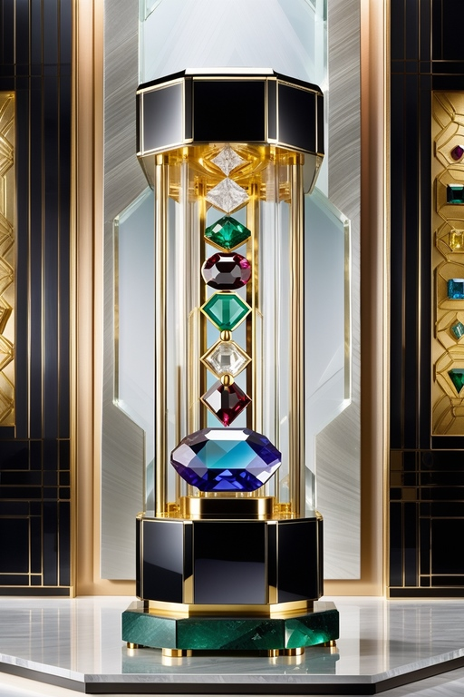

 

### _**Delight yourself with these wonderful jewels. Try to empty the money from the return box, and you'll receive a reward. Remember the price of the jewels; you will also have the chance to earn the Unknown stone.**_

_**JavaScript code to handle correct purchases and returns on a real, physical product vending machine.**_

 

--------

> [!NOTE]
>* You only use one button: `Try Offer` / `Get Jewel` with `CLICK` or `Touch(on mobile)`. 
>* On **PC**, Just use the `Enter` key and the `number keys`.

>[!IMPORTANT]
>* Steps

| | |
| - | - |
| 1st | Click/Touch `Get Jewel` or press _ENTER_.                                                         |
| 2nd | Add the price of the jewel + a group of coins of your choice, and press `Try Offert` or _ENTER_.  |
| 3rd | Repeat steps 1 and 2, until there are no coins left (in green) for return, which the machine has. |
| 4th | Press the new `CONGRATULATIONS` button and download your reward jewel.                            |
| | |

>[!TIP]
>💎 Play until you get all the available jewel rewards 🎁x10
><table align="center">
>    <tr>
>        <td align="center">
>                         src="./images/Shappire-100.jpg" />
>             
>             Shappire $500
>        </td>
>        <td align="center">
>                        src="./images/Tanzanite-100.jpg" />
>             
>             Tanzanite $615
>        </td>
>        <td align="center">
>                        src="./images/Emerald-100.jpg" />
>             
>             Emerald $675
>        </td>
>        <td align="center">
>                        src="./images/Ruby-100.jpg" />
>             
>            Ruby $780
>        </td>
>        <td align="center">
>                        src="./images/Alexandrite-100.jpg" />
>             
>            Alexandrite $1000
>        </td>
>    </tr>
>    <tr>
>        <td align="center">
>                        src="./images/Serendibite-100.jpg" />
>             
>            Serendibite $1200
>        </td>
>        <td align="center">
>                        src="./images/Diamond-100.jpg" />
>             
>            Diamond $1499
>        </td>
>        <td align="center">
>                        src="./images/Grandidierite-100.jpg" />
>             
>            Grandidierite $1990
>        </td>
>        <td align="center">
>                        src="./images/Benitoite-100.jpg" />
>             
>            Benitoite $2998
>        </td>
>        <td align="center">
>                        src="./images/Unknown-100.jpg" />
>             
>            Unknown ????
>        </td>
>    </tr>
></table>

--------

# 🟦 **Visit website:** [The Jewel Show ↗](https://conancos.dev/next/logica-js/CashRegister/index.html) 🟦

 

